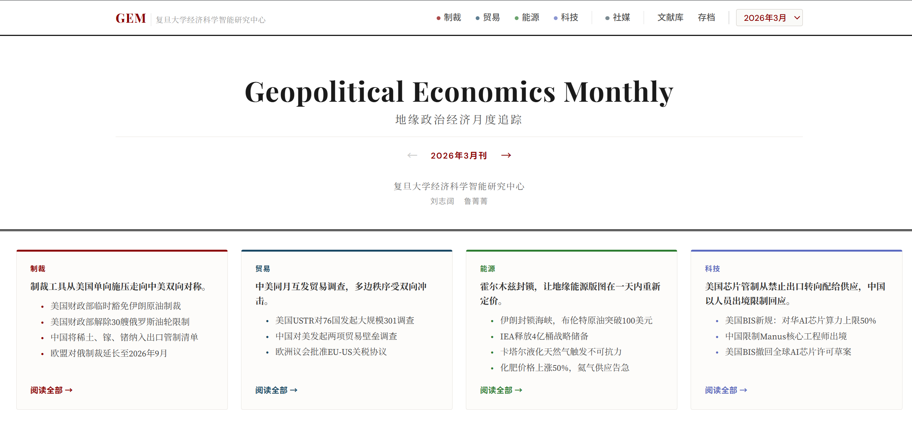
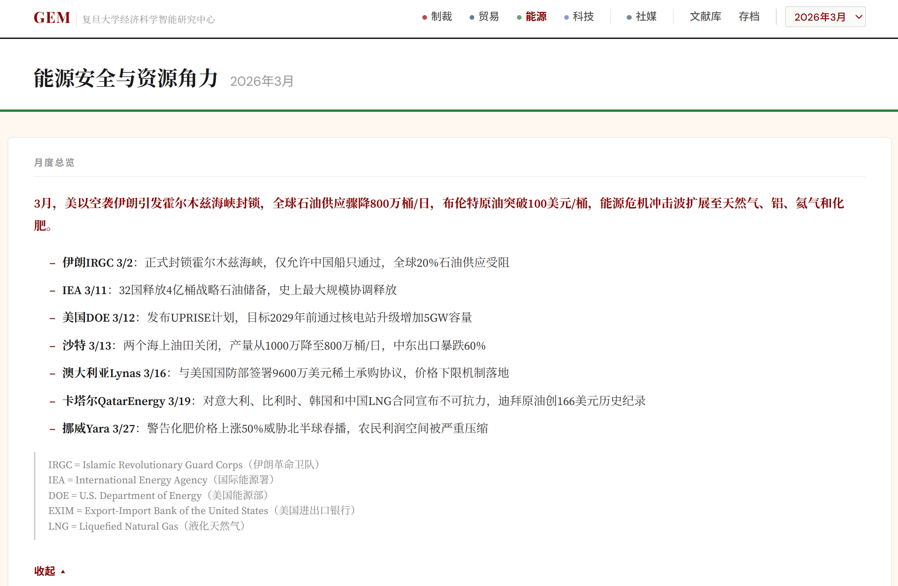
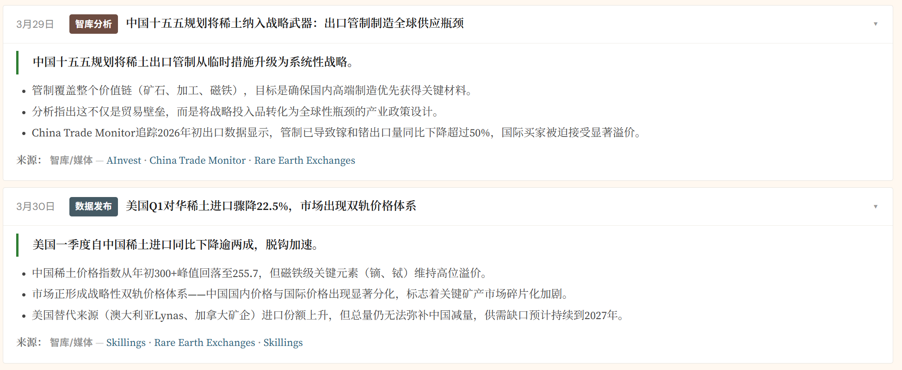

<!-- _class: lead -->

# 用 AI 做地缘政治经济月报

## 从信息采集到网站发布的完整实践

复旦大学经济科学智能研究中心
2026 年 4 月

---

## 为什么做这个项目

地缘政治经济信息分散在几十个政府网站、国际机构和媒体上，手动跟踪效率太低。

我们的想法是：**用 AI Agent 实时跟踪地缘政治资讯，在实践中把流程写成 SOP，做到每月同质量的持续跟踪。**

过程中发现三个必须解决的问题：

1. 信息散落在白宫、商务部、WTO、智库、媒体各处，没有统一的采集和整理流程
2. 中英文信息不对称，研究者需要同时看白宫和新华社，但很少有一个地方把双方都收齐
3. 人工写月报质量波动大，需要一套可复用的标准和检查机制

---

## 我们做了什么

把每月地缘政治经济事件按五个板块（制裁、贸易、能源、技术、综合地缘）做成一份可搜索的月报网站。

具体流程：AI 从几十个信息源自动采集，人工筛选确认后，写成结构化卡片，一键生成静态网站发布。

### 五个议题板块

| 板块                  | 覆盖什么                                      |
| --------------------- | --------------------------------------------- |
| T1 制裁与经济管制     | OFAC/EU 制裁、SWIFT、美元武器化、人民币国际化 |
| T2 贸易与产业政策     | 关税、301 调查、CHIPS 法案、WTO 改革          |
| T3 能源安全与资源角力 | OPEC、锂钴稀土、粮食安全、LNG                 |
| T4 技术竞争与规则制定 | 半导体出口管制、AI 治理、数据主权             |
| T5 更多社媒资讯       | 以上不覆盖的外交安全事件，从社媒策展中补充    |

---

---

## 信息从哪来：四层来源体系

我们把信息来源分成四个可信度层级，采集时按层级优先：

|    层级    | 定位               | 来源举例                                  |
| :---------: | ------------------ | ----------------------------------------- |
| **A** | 官方政府和监管机构 | 白宫、USTR、BIS、OFAC、中国商务部、新华社 |
| **B** | 国际机构           | IMF、WTO、IEA、OECD                       |
| **C** | 智库和主流媒体     | FT、Reuters、Bloomberg、PIIE、CFR         |
| **D** | 社交媒体和社区     | Reddit r/geopolitics、X/Twitter           |

### 三条底线

- 每份月报中，官方来源（A 层）占比不低于 30%
- D 层只拿来发现事件线索，最终必须回溯到 A/B/C 层的权威来源
- 涉及中方行动的事件，必须有中方官方来源，不能只靠西方媒体转述

---

## 怎么搜

核心工具是 **Exa 搜索**（AI 搜索引擎），每个议题准备五到八组英文关键词，按议题逐组搜索。Exa 适合回溯七天以上的历史事件，是我们的主力。

补充工具是 **RSS 订阅**（Bloomberg、WSJ、白宫等的实时推送），用来发现最近两三天的新事件。

发现事件后，用 **trafilatura**（Python 网页正文提取工具）抓取 A 层来源的原文全文，读细节。

搜索时需要注意：每个议题的中方视角要**单独搜**，因为新华社和商务部的内容不会自动出现在英文关键词的结果里。IMF、IEA 等国际机构没有可用的 RSS，必须靠 Exa 覆盖。

---

## 怎么筛：30 天法则

> **这件事在 30 天后还重要吗？它改变了什么结构性的东西？**

答案是"不"就不收。口头警告、例行访问、当日油价波动、推测性分析都不要。

但如果某件事是**第一次**发生（首次制裁、首次管制、首次启动调查），即使看起来小也照收，因为"第一次"有标杆意义。

---

## 怎么写：事件卡片的结构

每条事件写成一张卡片，结构是：一句话导语，三到五条事实要点，最后标来源。

### 导语

用 20 到 40 个汉字，一句话说清"谁对谁做了什么"。这句话必须让读者立刻明白这件事为什么放在这个板块。

### 事实要点

每条要点是一个独立信息点：核心事实带数字、背景或影响、时间节点或前瞻。至少写三条，避免卡片内容单薄。

### 来源标注

A 层来源放最前面。每条事件都必须有明确的来源链接。

---

---

## 写作上最重要的五件事

1. **导语严格 20 到 40 字**——太短缺信息，太长读者扫不完
2. **每张卡片至少三条事实要点**——事实、背景、影响三个维度是底线
3. **导语只写官方行动**——咨询公司的报告、企业动态这些放要点里，不放导语
4. **写清楚谁对谁做了什么**——"美国 USTR 对 76 国发起 301 调查"，不写"贸易政策出现调整"
5. **机构名前面加国别**——写"美国 BIS""美国 OFAC"，不能只写缩写，地缘政治报告里国别是第一信息

---

## 写作风格：学财新和经济观察报

### 财新的做法

每句话有信源——日期、机构、动作。不做判断，不写"这意味着""这标志着"，事实摆出来让读者自己想。

### 经济观察报的做法

始终追问"谁受益、谁受损"。分析不锚在抽象框架上，锚在利益关系上。

### 不要的写法

"结构性演变""三条主线""标志着新时代的到来""值得关注的是"——这些都是 AI 套话，一律删掉。用"华盛顿""北京"代指国家也不要，中文报告直接说"美国""中国"。

---

---
## 质量怎么把关

每条事件写完后问自己三个问题：

1. **读者看完导语，能不能一句话转述给别人？** 如果不能，说明导语没写清楚谁做了什么。

2. **事实要点有没有给足背景？** 只有一个事实不够，读者需要知道为什么重要、影响了谁。至少需要三条要点。

3. **来源经得起追问吗？** 涉及中方行动只有 Reuters 转述，不够。必须有中方官方来源。官方来源在整份报告里不能低于三成。

---

## 踩坑记录

**质量标准要在第一次写的时候就达标。** 我们一开始没这么做，结果 101 条事件里有 78 条返工，花了大约六个小时。经验是：宁可第一遍写慢点，也不要留返工。

**修之前先审计。** 不要发现问题就开始改，先统计有多少条不达标、分别是什么问题，列出清单再动手。盲目修复效率极低。

**涉中事件必须有中方来源。** 只靠西方媒体转述中方行动，视角一定是偏的。新华社英文版是必查来源。

---

<!-- _class: lead -->

# 谢谢

项目地址：geopolitics-tracking.pages.dev
